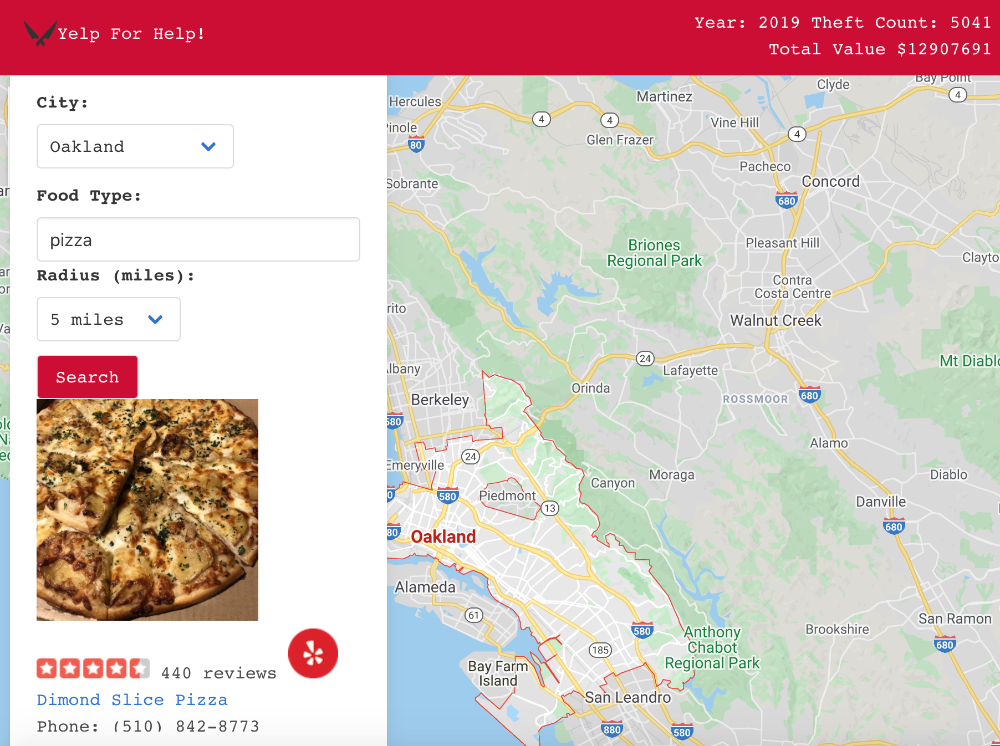

# Yelp For Help!

## Deployment

GitHub: https://github.com/DCuadra85/dreamteamrepo

Deployment: https://dcuadra85.github.io/dreamteamrepo/

## Tech Used

* HTML
* Bulma
* JavaScript
* JQuery
* AJAX
* GitLab
* GitHub

## Usage




Have you ever had your car broken into while you're out and about with friends? Have no fear! We have created a page where you can compare areas based on car break ins. 

The user is immediately presented with a homescreen displaying the name and logo. When the logo is clicked it takes them to the mapped screen where they are given an option of 3 cities to search: San Francisco, Oakland, or Berkeley. Next they are given an input to describe a desired meal. The user is then given 3 choices of radius for the food: 5, 10, or 20 miles. After the user clicks submit they are given multiple restaraunts. At the top of the screen, crime data will appear showing the year the data was collected, the total car break ins in the city, and the total loss from the crimes.

If the user doesn't input any information it will provide feedback to ensure there is valid input for the search results. Yelp has defaults and this prevents the page from using the default. See code below:

```
  $("#search-btn").on("click", function(event){
    event.preventDefault();
    if ($("#foodCategory").val() === "" || $("#myselect option:selected").text() === "Choose a City"){
      return
    } else {
      renderYelp();
    }
  })
```

Two APIs were used to develop this webpage: Yelp and FOIA. This uses California law enforcement ORI inside the FOIA api to pinpoint the location of crime data. The ORI was obtained from [Umich](https://www.icpsr.umich.edu/files/NACJD/ORIs/06oris.html). 

```
var cityIndex = {
    "CA0010900": "Oakland",
    "CA0010300": "Berkeley",
    "CA0380100": "San Francisco"
}
```

The Yelp API pulls information about each restaraunt: sample image, star rating, number of reviews, name, phone number, and address of the restaraunt. When clicked, each restaraunt will take the user to the yelp page for more information.


<hr>

## Future Development

In future developments of this webpage, the map will pin locations of crimes and restaraunts. There will also be more options of cities.

<hr>

## Sources

* [Bulma.io](https://bulma.io/)
* [Yelp Api](https://www.yelp.com/developers/documentation/v3)
* [FOIA Api](https://www.foia.gov/developer/)
* [Google Maps](https://developers.google.com/maps/documentation)

<hr>

## MIT Lisence

Permission is hereby granted, free of charge, to any person obtaining a copy of this software and associated documentation files (the "Software"), to deal in the Software without restriction, including without limitation the rights to use, copy, modify, merge, publish, distribute, sublicense, and/or sell copies of the Software, and to permit persons to whom the Software is furnished to do so, subject to the following conditions:

The above copyright notice and this permission notice shall be included in all copies or substantial portions of the Software.

THE SOFTWARE IS PROVIDED "AS IS", WITHOUT WARRANTY OF ANY KIND, EXPRESS OR IMPLIED, INCLUDING BUT NOT LIMITED TO THE WARRANTIES OF MERCHANTABILITY, FITNESS FOR A PARTICULAR PURPOSE AND NONINFRINGEMENT. IN NO EVENT SHALL THE AUTHORS OR COPYRIGHT HOLDERS BE LIABLE FOR ANY CLAIM, DAMAGES OR OTHER LIABILITY, WHETHER IN AN ACTION OF CONTRACT, TORT OR OTHERWISE, ARISING FROM, OUT OF OR IN CONNECTION WITH THE SOFTWARE OR THE USE OR OTHER DEALINGS IN THE SOFTWARE.


<hr>
<hr>

## Authors

Daniel Caudra

https://github.com/DCuadra85

Jennifer Henry

https://github.com/jenryhennifer

Rebecca Eng

https://github.com/engrebecca